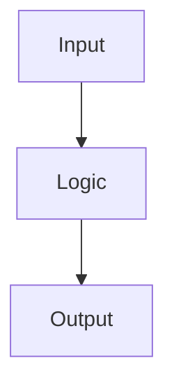

# [Ticket-ID]: [Feature Name]

- **Date**: [YYYY-MM-DD]
- **Stack**: [detected via recon / chosen in /bootstrap]
- **Standards Source**: [AGENTS.md / CLAUDE.md]
- **Execution Mode**: [Autonomous | Supervised]   <!-- set by /ship Step 0 -->

## 1. Background
[Technical context from the ticket + codebase analysis]

## 2. Goal (Definition of Done)
- [ ] [Functional requirement 1]
- [ ] [Functional requirement 2]

## 3. Architecture Proposal
### 🧩 Reusable Assets Inventory (anti-reinvention)
- `[path]` -> [role]
### ⚠️ Critical Constraints & Standards
- [framework / domain rule]
### Data Flow / Strategy
- [high-level strategy]
### Visualization

## 4. Testing & Verification
- **Lint**: `[command]`
- **Unit**: `[command]`
- **E2E / Integration**: `[command]`
- **Single test**: `[command pattern]`

### 🤖 Agent Execution Guidelines (Testing Trophy + strict TDD)
- Prioritize E2E/Integration; Unit only for mappers / pure / complex logic.
- Per task: write test → RED → implement → GREEN → refactor. Stop on any failure.
