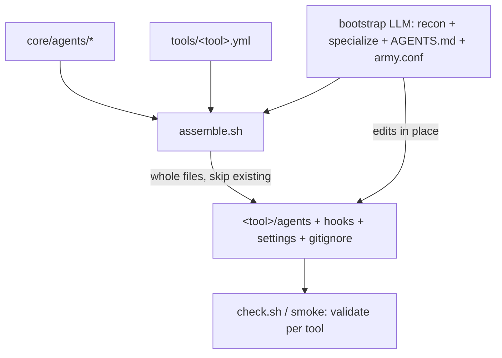

# ARMY-CORE: shared agent core + per-tool descriptors + deterministic assembler

- **Date**: 2026-07-02
- **Stack**: apm package — Markdown agent/skill prompts + `bash` hooks + `scripts/check.sh` (structural) & `scripts/smoke.sh` (e2e). No app runtime; the "product" is the materialized agent team.
- **Standards Source**: AGENTS.md
- **Interaction policy**: [autonomous | interactive | unset]   <!-- selected per PR by /ship before execution -->

## 1. Background
Today `baseline/` is a single `.claude`-shaped file set (with placeholders), and `bootstrap` (an LLM) materializes it per tool through **prose branching** in `SKILL.md`: which hooks to copy, which dirs, husky wiring, `.gitignore`, skills location, path substitution. Every cross-tool difference is a "soft if" the model must execute. This session surfaced a run of per-tool bugs (inert hooks copied to non-Claude, husky clobber, hardcoded `.claude/` paths, skills in `.agents` vs `.claude`, command-vs-agent split, context-budget with no home) — all the same root cause: **tool packaging lives as fragile prose an LLM interprets.**

The valuable, genuinely-soft work — specializing agents to THIS repo — must stay with the LLM. The mechanical work — packaging per tool — should be data + code. This blueprint cuts exactly along that line.

## 2. Goal (Definition of Done)
- [ ] Agent CONTENT exists **once**, tool-agnostic (`core/agents/*.md`).
- [ ] Each tool has an explicit, **data** descriptor (`tools/<tool>.yml`): dirs, frontmatter rules, capabilities, live hooks, skills location.
- [ ] A **deterministic assembler** (`assemble.sh`) materializes tool-native files from core + descriptor. No packaging "soft ifs" remain in prose.
- [ ] The materialized output is **whole, self-contained agent files** — never proxies/stubs pointing back at `core/`.
- [ ] The assembler **never clobbers** an existing (specialized/hand-edited) target file; rollback stays git-based (no `.base`).
- [ ] `bootstrap` (LLM) does ONLY judgment work: recon + **specialize agents to the repo** + author AGENTS.md content + set `army.conf`; it CALLS the assembler for packaging, then verifies.
- [ ] `check.sh`/smoke validate the assembled per-tool output with zero LLM.

## 3. Architecture Proposal
### 🧩 Reusable Assets Inventory (anti-reinvention)
- `.apm/skills/bootstrap/baseline/agents/*.md` (with inline output-skeletons) -> become `core/agents/*.md` after paths are extracted.
- `scripts/check.sh` placeholder-guard (target-dir mode) -> extended to validate assembler output.
- `baseline/hooks/git-pre-commit.sh`, `detect.sh`, `quality.yml` (already self-locating), the husky-aware wiring, the skills-dir `.gitignore` rule -> **move OUT of SKILL.md prose INTO the assembler** (this is the heart of the refactor).
- `baseline/settings.json` -> emitted by the assembler only when the descriptor says `hook_mechanism: claude-settings`.

### ⚠️ Critical Constraints & Standards
- **Cut line:** packaging = deterministic (script); repo-specialization = LLM. Do NOT try to determinize recon/specialization.
- **Whole agents in output:** the assembler emits complete standalone agent files (everything inline). No `core/` indirection leaks into the materialized team — tools load full files, not pointers.
- **Non-destructive:** the assembler treats an existing target as authoritative — it skips (or packaging-only `--reconcile`s) rather than overwriting specialized content. Git is the rollback.
- **One source of per-tool knowledge:** adding a tool = one descriptor file, not prose edits in five places.
- **Capability flags, not pretense:** if a tool has no subagents (Copilot) the descriptor says `subagents: false` and the assembler degrades explicitly to "AGENTS.md instructions + git/CI", never a blind sed.
- **Specialization is bootstrap's primary job** — the assembler stages an empty-of-repo-knowledge team; bootstrap fills it with this repo's commands/laws/idioms.

### Data Flow / Strategy
```
core/agents/*   ─┐
tools/<tool>.yml ┼─►  assemble.sh <tool>  ──►  <tool>/agents, hooks, settings.json, .gitignore, git hook
                 │            ▲                 (whole files; skips existing; --dry-run)
bootstrap(LLM): recon → specialize the materialized agents in place →
                author AGENTS.md → write army.conf → call assembler → verify ──┘
```
Order per run: **assemble (scaffold) → specialize (LLM edits in place) → verify.** Re-run: assembler skips existing files; bootstrap re-specializes in place.

### Visualization


## 4. Testing & Verification
- **Lint**: `bash -n` on `assemble.sh` + shellcheck if available.
- **Structural**: `bash scripts/check.sh` (baseline) + `bash scripts/check.sh --target-dir <assembled>` (materialized).
- **Assembler unit**: `bash assemble.sh <tool> --dry-run` asserts exact layout (dirs, hook set, gitignore, frontmatter) for `claude` and `opencode`.
- **E2E**: `bash scripts/smoke.sh` — install → bootstrap → assemble → validate per tool; zero placeholders, zero `.claude` on non-Claude, existing files untouched on re-run.
- **Single test**: `bash scripts/check.sh --target-dir <dir> <agentname>`.

### 🤖 Agent Execution Guidelines (Testing Trophy + strict TDD)
- This repo has no unit framework; "tests" are `check.sh`/`smoke.sh` assertions + `assemble.sh --dry-run` diffs. Treat those as the RED/GREEN gate.
- Per task: add/adjust the check → see it RED (assert-before) → implement → GREEN. Stop on any failure.
- Prioritize the assembler dry-run + check.sh assertions (integration-level) over micro-unit checks.
