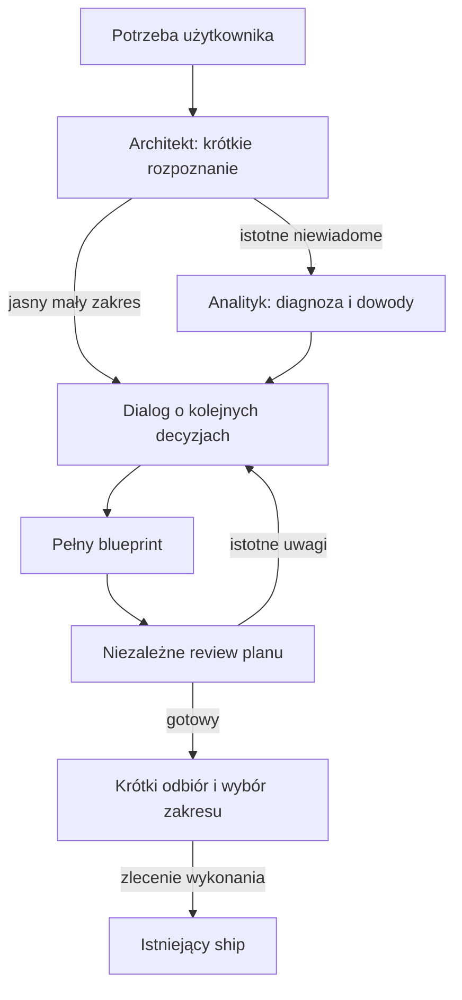

# ARMY-INTERACTIVE-PLANNING — interaktywny architekt z analizą i review

- Data: 2026-10-02.
- Status: projekt do implementacji; zapis dokumentacji nie oznacza wdrożenia ani zgody na commit.
- Cel implementacji: bieżące źródłowe repo Agent Army, materiały produktowe pod `.apm/`.
- Środowisko pierwszego pilotażu: Claude Code; zachować obecne adaptery i jawne ograniczenia pozostałych narzędzi.
- Zastępuje: wcześniejszy projekt osobnego `PERSONAL-AI-TOOLKIT`.

## 1. Problem i zakres

Architekt potrafi zebrać wymagania i stworzyć blueprint, ale jednorazowy duży dokument utrudnia
użytkownikowi podejmowanie decyzji. Błędna diagnoza lub niezweryfikowane założenie mogą przejść do planu,
a jego autor może przeoczyć własny błąd. Rozwiązaniem jest rozbudowa obecnego procesu Army.

Dodajemy dwie role: `planning-analyst` przed projektowaniem oraz `plan-reviewer` po złożeniu planu.
Architekt pozostaje jednym rozmówcą i właścicielem planu. Tworzy cały plan przez rozmowę przed wykonaniem.
To rozszerzenie nie tworzy osobnego toolkitu, nowej paczki, zestawu `/kit-*`, drugiego executora ani nowego systemu stanu.
Niezależne workflow spoza planowania Army są tylko opcjami opisanymi osobno, nie częścią PR 1–4.
Plan obejmuje też dalsze etapy utrzymania Army: audyt reguł i gotowości repo, zbiorczy status oraz warunkowo E2E.
Etapy mają zadania i kryteria odbioru; aktualizacja dokumentacji nie uruchamia ich wykonania.

## 2. Definition of Done

- Użytkownik omawia jeden istotny temat naraz, z rekomendacją, alternatywami i krótkim przyrostem planu.
- Agent nie pyta o fakty dostępne w repo i nie powtarza ustalonych decyzji.
- Analityk sprawdza ramę problemu i zbiera dowody; architekt nie dubluje całego researchu.
- Przy małym, jasnym zadaniu można pominąć osobnego analityka z krótkim uzasadnieniem.
- Gotowy blueprint przechodzi review w świeżym kontekście przed przekazaniem do wykonania.
- Brak niezależnego kontekstu jest jawny; samoocena nie jest przedstawiana jako niezależne review.
- Plan i rozmowę można wznowić z `design-docs`, bez transkryptu i ponownego wywiadu.
- Zmiana decyzji aktualizuje zależne przyszłe części w miejscu, zachowując zakończone dowody.
- Planowanie nie uruchamia implementacji; tryb wykonania nadal należy do `/ship`.
- Instalacja i migracja zachowują specjalizacje ról, modele użytkownika i istniejące kontrole.
- Próby zachowania pokazują wartość ponad dotychczasowego architekta, nie tylko poprawny rendering.

## 3. Architektura i odpowiedzialności

| Rola | Odpowiedzialność | Zapis |
|---|---|---|
| `planning-analyst` | Objaw vs hipoteza, research, dowody, luki i możliwe dalsze sprawdzenia | Raport zwracany koordynatorowi; bez własnych edycji |
| `architect` | Rozmowa, decyzje, podejście, podział pracy, blueprint i korekty | Jedyny logiczny właściciel aktualnego planu |
| `plan-reviewer` | Ocena planu względem celu, źródeł, ryzyk i kosztu | Raport zwracany koordynatorowi; bez napraw planu |
| `/ship` / główna sesja | Wywołania ról, utrwalanie zatwierdzonych wyników, dotychczasowa bramka wykonania | Istniejący Execution State po planowaniu |

Wywołania wykonuje główna sesja. Nie zakładamy zagnieżdżonej delegacji przez subagenta-architekta.
Jeśli architekt pracuje jako subagent, zwraca koordynatorowi zlecenie roli albo pytanie do użytkownika.
Koordynator przekazuje odpowiedź; użytkownik nadal ma jedną rozmowę.

## 4. Decyzje produktowe

- Nowy proces w v1 jest wyłącznie interaktywny: pełny plan przed implementacją.
- Brak nowego wyboru między trzema trybami planowania; „zaproponuj sam ten szczegół” jest częścią dialogu.
- Nie mylimy tego z firmowym `interactive rolling`: szczegóły następnego etapu dopiero po wykonaniu poprzedniego.
- Zapisane wcześniej tryby i zgody istniejących blueprintów nie są migrowane bez podstawy.
- Wykonanie może pozostać autonomiczne albo interaktywne zgodnie z obecną polityką `/ship`.
- Analityk jest warunkowy; recenzent jest wymagany przed oddaniem nowego blueprintu do wykonania.
- Stan planowania żyje w manifeście; stan zadań wykonawczych nadal w plikach PR.
- Nie używamy `.agent-army/state.json` do planów: plik służy propozycjom ulepszeń Army.

## 5. Plan realizacji

| Etap | Rezultat |
|---|---|
| [PR 1 — Role](01_PR_1_Roles.md) | Kontrakty analityka i recenzenta, przykłady i próby |
| [PR 2 — Dialog](02_PR_2_Dialog.md) | Interaktywny architekt, stan rozmowy i korekty planu |
| [PR 3 — Integracja](03_PR_3_Integration.md) | Bootstrap, migracje, routing i przekazanie do `/ship` |
| [PR 4 — Ocena](04_PR_4_Validation.md) | Testy adapterów, próby zachowania i realne pilotaże |
| [PR 5 — Reguły i gotowość repo](09_SCOPE_AND_PRIORITIES.md#pr-5-reguły-i-gotowość-repo) | Audyt w adapt-army i raport readiness w bootstrap, po odbiorze PR 4 |
| [PR 6 — Status prac](09_SCOPE_AND_PRIORITIES.md#pr-6-zbiorczy-status-prac) | Odczyt planowania i wykonania przez army-status, bez nowej bazy stanu |
| [PR 7 — E2E](09_SCOPE_AND_PRIORITIES.md#pr-7-procedura-e2e) | Warunkowe rozszerzenie testera dla działającej aplikacji i danych testowych |

PR 1–6 mają status `planned`; PR 7 jest `conditional` i wymaga wskazanego przypadku przeglądarkowego.
Każdy przyrost weryfikujemy na bieżąco. PR 1–4 stanowią pierwszy samodzielny rezultat; nie czekają na PR 5–7.
Numery PR są jednostkami planu, nie istniejącymi pull requestami.
Kontrakt wykonawczy procesu: [00_PROTOCOL.md](00_PROTOCOL.md).
Przyszłe użycie: [06_USAGE.md](06_USAGE.md).
Ocena pozostałych inspiracji: [05_MATERIALS_ASSESSMENT.md](05_MATERIALS_ASSESSMENT.md).
Wprowadzone już reguły istniejących ról: [07_BASELINE_RULES.md](07_BASELINE_RULES.md).
Nie oznacza to wykonania PR 1–4 ani wdrożenia nowych agentów i interaktywnego dialogu.

Materiały pomocnicze do planu:
- [08 — porównanie wszystkich 33 skilli](08_CATALOG_COMPARISON.md): co mamy, częściowe pokrycie i braki.
- [09 — kolejność i zadania dalszych etapów](09_SCOPE_AND_PRIORITIES.md): PR 5–7, zależności i odbiór.
- [10 — osobne skille](10_OPTIONAL_SKILLS.md): kontrakty opcjonalnych workflow poza rdzeniem Army.

## 6. Źródła, aktualny stan i ponowne użycie

- [Architekt](../../.apm/skills/bootstrap/baseline/core/agents/architect.md): istniejący blueprint, wywiad i zasady korekt.
- [Ship](../../.apm/skills/ship/SKILL.md): karty interakcji, zakres wykonania, wznowienie i obowiązkowa bramka blueprintu.
- [Bootstrap](../../.apm/skills/bootstrap/bootstrap.py): siedem ról w `ROLES`, mapowanie możliwości i bezpieczna aktualizacja.
- `_STANDARD.md`: role przenośne, minimalne uprawnienia, delegacja, niezależne review i konkretne przykłady.
- Firmowy `allegro-coding-plugins/plugins/agent-army`: wzorce rolling blueprint, Impact Sweep i kart interakcji;
  przeczytane lokalnie, nie zależność ani źródło do automatycznego kopiowania.
- Materiały użytkownika o modelach rozumujących i 10x: cele, dowody, proporcjonalność i ciągłość.

Stan repo ma istniejące niezacommitowane zmiany. Implementacja musi je uwzględnić i nie nadpisywać ich.
Dokumentacja oraz deklaracje adapterów nie dowodzą skuteczności agentów; pilotaż jest osobnym warunkiem.

## 7. Ograniczenia i dziennik decyzji

Poza zakresem: nowy executor, osobny Learn/Checkpoint, nowe hooki, system centralnej pamięci,
pełny port firmowego pluginu, autonomiczne planowanie, CI review, deployment i agenci działający w tle.
Nie przebudowujemy całego executora `/ship`. Zachowane lokalne reguły ról doprecyzowują wąską ścieżkę
zatwierdzonego refaktoru zachowującego zachowanie: zielony baseline przed i sprawdzenie po zmianie,
z zachowaniem bramek zakresu, interakcji i wymaganych kontroli projektu.

- 2026-10-01: użytkownik wybrał cały plan tworzony przez rozmowę przed wykonaniem.
- 2026-10-02: zastąpiono osobny toolkit rozszerzeniem architekta Army z dwiema rolami pomocniczymi.
- 2026-10-02: zlecono zapis tego design doc i ocenę pozostałych inspiracji; bez implementacji i commitów.
- 2026-10-02: prośbę o wplecenie sześciu zasad błędnie rozszerzono z dokumentacji na instrukcje ról.
  Po wyjaśnieniu użytkownik wyraźnie wybrał zachowanie tych zmian. Pierwsze dwie należą do testera;
  zakres opisuje 07_BASELINE_RULES. PR 1–4 nadal są planowane.
- 2026-10-02: dodano analizę pełnego katalogu 33 skilli. Bieżące zlecenie obejmuje tylko design docs i ocenę,
  bez dalszych zmian instrukcji. Opcje z 09–10 wymagają wyboru, nie stają się obowiązkową kolejką wdrożenia.
- 2026-10-02: na doprecyzowanie użytkownika włączono wybrane rekomendacje bezpośrednio do planu:
  zadania w PR 1–4 oraz dalsze PR 5–6 i warunkowy PR 7. Osobne skille pozostają opcjonalną ścieżką.
  Wykonanie żadnego nowego etapu nie zostało rozpoczęte.
