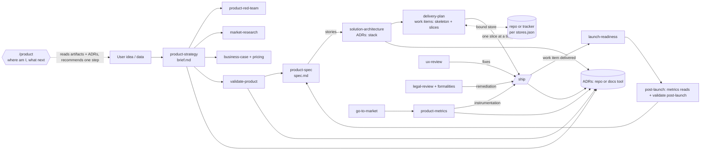

# ARMY-PRODUCT-ADVISORS: Product advisors for Agent Army (v0.4.0)

- **Date**: 2026-10-08
- **Stack**: Markdown skills + Python 3 generator (`.apm/skills/bootstrap/bootstrap.py`) + Bash checks; APM distribution; no build step
- **Standards Source**: `AGENTS.md`; agent quality bar `.apm/skills/bootstrap/baseline/core/agents/_STANDARD.md`

## Planning Session
- **Mode:** interactive-complete
- **Stage:** review
- **Progress:** execution: PR 1 done; PRs 2–5 `ready_for_human_review` (PR 5: Task 5.2 closed without a run, external stores unproven against a real connector); PR 6 `in_progress` (closure: S8 re-run, manual fixture runs); PRs 7–8 `planned`. Planning finished at step 7 of 7; the independent plan review was never run.
- **Planning completion criteria:** every scope/sourcing/evaluation decision is recorded below; each PR file has contracts, write scope and verification; an independent review of revision 6 has no open blocking findings
- **Current topic:** none
- **Pending decision:** none
- **Remaining topics:** independent plan review (`plan-reviewer`, fresh context)
- **Decision log:**
  - D1 Audience: solo founder or small team. Advisors are optional, independently callable skills, not `/ship` stages; they work without `/bootstrap` and without historical `design-docs`.
  - D2 Sourcing: self-contained advisors (variant A). No dependencies in `apm.yml`. The package does not recommend, link, detect or invoke third-party skills. Borrowed ideas get attribution in the skill and in `.apm/SOURCES.md` only.
  - D3 Scope: thirteen advisors plus one navigator, each a separate skill (the "product skills"). Advisors: `product-strategy`, `product-red-team`, `market-research`, `business-case`, `validate-product`, `product-spec`, `solution-architecture`, `delivery-plan`, `go-to-market`, `product-metrics`, `ux-review`, `legal-review`, `launch-readiness`. Navigator: `product`. Package total: 19 skills.
  - D9 Navigation: `/product` is the entry point for "where am I, what did I skip, what next". It is read-only over the artifacts, recommends exactly one step and never runs other skills. It owns only `skip` records (deliberate skips; repo default `docs/product/journey.md`) and shows/changes store bindings. Every advisor also ends with one line pointing to `/product`.
  - D10 Path completeness: `product-spec` bridges a validated brief to `/ship` (MVP scope, stories, acceptance). Without new skills: pricing in `business-case` (with price tests in `validate-product`), formalities in `legal-review` (entity, VAT incl. EU OSS, invoicing, payment provider/merchant of record), and a post-launch mode in `validate-product` (churn and cancellation interviews, support synthesis, retention hypotheses). Out of scope: fundraising, hiring, visual brand design, support tooling.
  - D11 High-level solution planning comes as two skills between `product-spec` and the task-level `architect`. `solution-architecture` decides architecture style, stack per layer and build vs buy, recorded as ADRs (rarely revisited). `delivery-plan` cuts the spec into a walking skeleton plus vertical, business-valuable slices and spikes, recorded as work items and re-run often. They are separate because their outputs, stores and cadence differ, and so a slice plan can be synced with a tracker without loading stack logic.
  - D12 Storage seam: skills operate on **record types** with stable IDs and schemas, not on file paths. Where each type lives is chosen **in the target project** by its user and recorded in `.agent-army/stores.json`; the default is the repo (Markdown, as before). An external store means a connector the user's agent environment already has (any tracker or docs tool). The package ships no tool-specific code, adapters or guides, and adds no dependency (D2 holds). Each type has one source of truth: no dual writes, no mirrors.
  - D4 Evaluation: a repo-local skill `advisor-eval` (not shipped) is built and dry-run first (PR 1); every advisor evaluation runs the candidate together with a plain-session control (arm K) in the same run, with no separate baseline run; it is re-run whenever an advisor or the shared contract changes.
  - D5 Decisions live only in ADRs (`docs/adr/` in the target repo), written by advisors and by `/ship` (`docs-writer`). `design-docs/` plans are temporary and deleted after the task ends, so a plan is never the only home of a rationale.
  - D7 Integration: full package integration, including changes outside `.apm/` (manifest, root docs, checks, tests). No commit, publish or release without the user's approval. All blueprint PRs land on one feature branch (GitHub PR #4) and the feature merges into `main` once, after PR 8.
  - D8 Versions: package and generator `0.4.0`; profile schema stays `2`.
  - D13 Mode recommendation: `/ship` still asks for the interaction mode once per PR and the user decides; the skill only recommends and never sets the mode itself. The question carries one recommendation derived from the selected tasks' Execution Profiles. It recommends **Interactive** if any task has `Bottleneck` `design_decision | multiple_approaches | unknown` or has no runnable Verification Command (a manual evaluation such as scorecard rows does not count), naming those tasks; otherwise it recommends **Autonomous**. In Interactive mode the task-review card says in `Review focus` when every remaining task qualifies for autonomous (the existing `switch to autonomous` option then applies). This gives "decide together, then let it run". The `architect` orders decision-heavy tasks first within a PR when dependencies allow, and writes each task to be as close to autonomous-ready as the work honestly allows: design decisions are settled with the user during planning, and each task gets a runnable Verification Command where one exists. It never biases the profile to earn the Autonomous recommendation: no downgraded `Bottleneck`, no cosmetic command that does not verify the contract. No new mode, pause, card field or gate.
  - D14 English-only status vocabulary: blueprint task statuses are canonical English tokens `open | in progress | in testing | in review | done | awaiting decision | blocked | conditional`, replacing the Polish `do zrobienia | w trakcie | do testów | do review | wykonane | czeka na decyzję | zablokowane | warunkowe` in `architect.md`, `/ship` and `check.sh` (Task 6.4). `/ship` still reads the legacy Polish values in existing blueprints and maps them one-to-one. This blueprint already uses the English tokens.
  - D15 No capability or deliberation recommendation at planning time: the task `Execution Profile` keeps `Bottleneck`, `Bottleneck rationale` and `Escalation trigger`, and drops `Capability` and `Deliberation`. The model comes from the role's routing configured in `/bootstrap` (or the tool default), effort is the tool default, and escalation follows the `Bottleneck` table in `/ship` (Task 6.4). This blueprint already uses the reduced profile.
  - D20 Live blueprint status (user, 2026-10-09, during PR 5): the manifest's `Progress` and `Next action` had stayed at the PR 1 state while PRs 2–4 finished. `/ship` §1.7 now refreshes these two fields at every PR status change, in the same write as the PR file; no other manifest field changes during execution.
  - D19 Lighter `/ship` Interactive mode (user, 2026-10-09, Task 6.6): beyond the pace paragraph, Interactive mode pauses once before a task (plan) and once after it (result) instead of separate RED / baseline / implementation acceptance cards; evidence and statuses stay in the PR file; "decide together, then let it run" (D13) is the default path. The always-on stops (external or irreversible actions, security/privacy/compliance, breaking contracts, scope expansion, final review, commit) stay in both modes. Still two modes and eight card fields. Settled with the user on 2026-10-10: pauses exist so the user keeps the thread and can steer, not to tick off steps. A short `task plan` before each task waits only when it carries a question or something unexpected (it replaces `RED acceptance`, `baseline acceptance` and `implementation acceptance`, and a legacy card resumes as `task plan`); RED → implementation → GREEN run without a routine pause; one `task review` follows each task; after a break `/ship` opens with one sentence on where the work stands.
  - D18 Lighter verification for skill prose (user, 2026-10-09, after Task 2.1): skills are checked by `check.sh` (structure, contract identity) and by the user's own use (each PR's manual acceptance). `advisor-eval` is a spot check, not a per-advisor gate: in PR 2 it runs on `product-strategy` and `validate-product` (arms N, K); later only when an advisor misbehaves in use or the contract changes meaning. The `advisor-eval` lines in PRs 3–5 Verification Commands become optional spot checks. Advisors are written in batches in Autonomous mode, without per-task cards; the user reviews each finished batch. Supersedes D4's "every advisor evaluation" and the per-skill gate in §2.
  - D17 No line limits on skill text: the advisor contract and skills have no fixed line or size cap (the rev 8 "≤ 120 lines" is removed; user, 2026-10-09). A line count is a proxy, like the word and turn counts D16 already rejects. The real risks are guarded where they show: cost per call and a method drowned by procedure by `advisor-eval` (`cost` criterion, N − K); advisor-specific rules leaking into the shared contract by review (the contract carries only rules that apply to all 14 product skills). `check.sh` prints the block size (lines, ≈ tokens) as information and never fails on it.
  - D16 Collaborative pace, for every skill: the user and the skill reach the result together instead of the skill producing a wall of text the user cannot review. Every turn shows `step X of ~Y`, and a changed estimate is announced with its reason. The rule (`interaction-pace:v1`, text in §3 Data Flow) lives in three overarching places only, not in each skill: the advisor contract (so all 14 product skills follow it, including when called directly without `/product`, D1), `/ship` (covers `architect` and the engineering roles it runs) and the baseline `AGENTS.md` (read by every tool in a target repo, so `bootstrap`, `new-agent`, `new-skill` and `adapt-army` follow it too). `check.sh` keeps the three copies identical. Created in Task 2.1 (contract), added to `/ship` and `AGENTS.md` in Task 6.5. `advisor-eval` judges it as the `pace` criterion (no fixed word or turn counts), which needs multi-turn sessions with a simulated user (Task 1.1).
- **Evidence:** see `## 1. Background`, "Sourcing evidence"
- **Plan revision:** 11 (rev 10 → 11: D19 and Task 6.6, lighter `/ship` Interactive mode). Rev 9 → 10 ( D18 eval becomes a spot check; advisors written in batches, Autonomous). Rev 8 → 9 ( D17 removes the 120-line contract cap; size is reported, cost and quality are judged by `advisor-eval`). Rev 7 → 8 ( no separate baseline run; arm K runs with every advisor evaluation; Task 1.3 becomes a policy). Rev 6 → 7 ( D16 collaborative pace for every skill, carried by the advisor contract, `/ship` and the baseline `AGENTS.md`; `pace` as the 9th eval criterion with a simulated user; Task 6.5). Rev 5 → 6 ( from the user's PR review: D13 says the user decides and the architect aims for autonomous-ready tasks without biasing the profile; D14 English status vocabulary; D15 no capability/deliberation at planning; planning-levels table; D6 removed; Task 6.4). Rev 4 → 5: D13 mode recommendation in `/ship`, Task 6.3. Rev 3 → 4: `solution-architecture` + `delivery-plan`, record types + `stores.json` seam, 12-stage model, product-spec stories feed `delivery-plan`, 19 skills, PRs renumbered 1–8. Rev 2 → 3: `/product` navigator with a stage model, `product-spec`, pricing/formalities/post-launch extensions, handoff status loop, 17 skills, PRs renumbered 1–7. Rev 1 → 2: +3 advisors, shared contract, ADR model, evaluation skill, `/ship` boundary.
- **Review:** pending (user approved revision 6 without an independent review; revision 7 not reviewed)
- **Last confirmed action:** user asked that every skill reach results together in ~30 s steps instead of walls of text (D16)
- **Next action:** finish PR 6 closure (S8 re-run, manual fixtures), then the user's final review of PR 6

## 1. Background
Agent Army 0.3.1 ships five skills (`bootstrap`, `ship`, `new-agent`, `new-skill`, `adapt-army`). Its roles cover engineering only. Product work (who buys, why, at what price, how it is marketed, legal exposure and launch readiness) has no support. `.apm/README.md` already contains a draft catalog of seven proposed advisors.

**Sourcing evidence (2026-10-07, external repos read as data, nothing installed or executed):**
- `phuryn/pm-skills@8607e3b` (MIT, 69 skills): one-shot templates without resume or a brief. `product-strategy` collides with our name. `strategy-red-team` is the most rigorous method we read (steelman → attack → "Fails if" → impact × likelihood × cheapness → kill criterion, cheapest test, "what I couldn't assess"). `pre-mortem` (Tigers/Paper Tigers/Elephants; blocking / 30 days / track), `identify-assumptions-new` (8 risk categories) and XYZ hypothesis plus Savoia principles are worth borrowing. `privacy-policy` promises "ready-to-publish" text from a frozen, undated law list, so we reject it. `/ship-check` covers code only. Before citing the "4 product risks", check the source: pm-skills attributes them to Torres, but they are usually credited to Cagan.
- `coreyhaines31/marketingskills@5e721d7` (MIT, 50 skills, average description 746 chars): v2.0 renamed 19 skills and moved its context file. That is direct evidence of upstream drift. Its `analytics` description triggers on "GTM" (Tag Manager). `marketing-loops` supplies the loop anatomy and the "When NOT to loop" rule.
- `deanpeters/Product-Manager-Skills`: CC BY-NC-SA 4.0, incompatible with our MIT package; it also gives the same formula for two payback metrics. `alirezarezvani`: 846 files; its GDPR skill runs bundled scripts and targets Germany only. `founder-skills`, `pratikshadake`, `lenny-skills`: too shallow, a third context file, or quotes useful only as reading. Only the Ship/Iterate/Kill rule is borrowed.
- Context budget (chars exact, tokens ≈ chars/4…3.5): five existing skills plus eight drafted advisors = 6,330 chars ≈ 1.6–1.8k tokens. All of pm-skills plus marketingskills would be ≈ 17–20k. Nineteen skills are estimated at ≈ 2.3–2.6k tokens. Re-measure after writing (target ≤ 300 chars per description).
- `bootstrap.py`: `SKILLS` is a fixed 5-tuple. `is_agent_army_skills()` requires all names; `materialize_skills()` copies only missing skill dirs (`dst.exists()` → skip). `package_inventory()` hashes `SKILLS` for the upgrade review. `smoke.sh:308` asserts "five shared skills" by probing two names. `apm.yml` description says "four live skills" and lists five.

## 2. Goal (Definition of Done)
- [ ] `advisor-eval` (repo-local) runs the scenario fixtures for candidate vs. control arms, writes a scorecard and applies the decision rule
- [ ] Fourteen product skills (13 advisors + `/product`) plus thin wrappers exist; each embeds the identical `advisor-contract:v1` block, has a clear scope/artifact/"Not for", and gives ≥ 2 examples (start + resume)
- [ ] `solution-architecture` proposes options per layer and records accepted choices as ADRs; `delivery-plan` produces a walking skeleton and vertical slices with outcome, acceptance and metric, each a work item `/ship` can execute
- [ ] Every record type works with the repo store by default, and with an external store bound in the project's `.agent-army/stores.json`; a missing connector stops the write instead of falling back silently
- [ ] `/product` shows the stage map, flags missing prerequisites and stale decisions, respects recorded skips and recommends exactly one next step
- [ ] Each product skill passes `check.sh`; `advisor-eval` spot checks (D18) show no false facts in arm N
- [ ] `docs-writer` and the `/ship` docs stage write ADRs with the shared template before commit; decisions from a `design-docs` plan reach an ADR before the task closes; a trivial fix produces no ADR; a delivered work item is marked `delivered` with evidence in whichever store it is bound to
- [ ] The advisor contract, `/ship` and the baseline `AGENTS.md` carry the identical `interaction-pace:v1` text (D16); `advisor-eval` scores `pace` from multi-turn sessions with a simulated user
- [ ] `/ship` Interactive mode pauses once before and once after each task, keeping every required stop (D19)
- [ ] `/ship` recommends an interaction mode from the selected tasks' Execution Profiles; the user decides and the recommendation never sets the mode; no new pause, mode or card field
- [ ] Blueprint task statuses use the English vocabulary (D14), legacy Polish values still resume; the task Execution Profile has no `Capability` or `Deliberation` and `/ship` routes from role configuration plus `Bottleneck` (D15)
- [ ] The generator registers 19 skills at `0.4.0`; a 0.3.1 → 0.4.0 upgrade preserves local specializations and controls, and an immediate re-run is a no-op
- [ ] `check.sh` and `smoke.sh` enforce contract identity, ADR field parity, registry ↔ skill ↔ wrapper agreement, no third-party install guidance and all 19 skills in every target; `stores.json` survives bootstrap and upgrade untouched
- [ ] The catalog and root docs describe actual behavior, including the `/ship` boundary table

## 3. Architecture Proposal
### 🧩 Reusable Assets Inventory (anti-reinvention)
- `.apm/skills/<name>/SKILL.md` + `.apm/commands/<name>.md` → existing skill/wrapper pattern (`.apm/commands/ship.md` is the wrapper template)
- `scripts/check.sh` `check_skill`, `check_interaction_contract` → pattern for skill lint and cross-file contract parity checks
- `tests/fixtures/ship-interaction/` (request / expected oracle / repo overlay) and `tests/judge/rubric.md` (JSON verdict) → pattern for `tests/fixtures/advisors/` and the eval judge
- `docs-writer.md` ADR skeleton → base of the shared ADR template (extended, not replaced)
- `bootstrap/SKILL.md` "Incremental Upgrade Review" + `--upgrade-review-outcome` → delivers the docs-writer recommendation on upgrade
- `.apm/README.md` → becomes the real catalog

### Delivery decision
- Build our own advisors. The evidence in section 1 shows that no external skill offers resume, a shared brief, an F/A/D register or a partial-result discipline. Dependencies bring name and trigger collisions, two sources of truth, no APM install path and a 10× larger description budget. Borrowed methods are rewritten into our contract with attribution, and nothing is copied verbatim. A verbatim copy of `strategy-red-team` into `product-red-team/references/` is allowed later only if `advisor-eval` shows our red-team is clearly weaker; it would carry a `Source: phuryn/pm-skills@8607e3b, MIT` header and the license text.

### Contract surfaces
- **`advisor-contract:v1` block** (new; authoritative copy is `.apm/skills/product-strategy/SKILL.md`; consumers: all 14 product skills) → `check.sh` asserts byte-identical copies between `<!-- advisor-contract:v1 -->` and `<!-- /advisor-contract:v1 -->`. Bump the version tag on any semantic change and re-run `advisor-eval`.
- **Record types** (consumers: product skills, `architect`, `docs-writer`, the user), defined in the contract with ID, owner and fields: `register` (F/A/D rows; owner `product-strategy`, others propose), `adr` (`ADR-NNN`; advisors + `docs-writer`), `story` (`S-n`; `product-spec`), `work_item` (`W-n`: slice, spike or fix handoff; `delivery-plan` and advisors with fixes; status `proposed | ready | in progress | delivered (evidence)`), `prediction` (`P-n`; `go-to-market`), `skip` (`journey`; `product`), plus one narrative `artifact` per advisor. Repo default locations: `docs/product/brief.md` (register), `docs/product/<advisor>.md`, `docs/product/spec.md` (stories), `docs/product/delivery-plan.md` (work items), `docs/product/journey.md` (skips), `docs/product/data/*.csv` (user exports, no personal data), `docs/adr/NNN-*.md`. An existing equivalent document or ADR directory takes precedence.
- **`.agent-army/stores.json`** (project-owned; consumers: every product skill, `docs-writer`, `architect`): `{"version": 1, "types": {"<type>": {"store": "repo" | "external", "connector": "<name as the agent environment lists it>", "container": "<project/board/folder id>", "id_in": "title-prefix" | "label" | "field:<name>", "field_map": {"<our field>": "<tool field>"}, "allowed": ["create", "update"]}}}`. A missing type means repo. `delete` is never allowed. Neither `/bootstrap` nor upgrades write this file.
- **Stage model** (consumers: `/product`, every advisor's closing line, catalog) → defined once, inside the contract block, so it is covered by the identity check.
- **Work item** (replaces the rev 3 handoff entry) `W-n | kind: slice | spike | fix | outcome ("a user can …") | acceptance | stories S-n | metric/event | depends on ADR/W | size S/M/L | status` (consumers: `delivery-plan`, advisors with fixes, `/ship` architect and `docs-writer`, `/product`) → `docs-writer` updates only `status`.
- **ADR template** (consumers: advisors, `docs-writer`) → `check.sh` asserts the same field set in the contract and in `docs-writer.md`.
- **`SKILLS` registry** (consumers: `materialize_skills`, `package_inventory`, upgrade review, smoke) → `check.sh` asserts registry == `.apm/skills/*` == `.apm/commands/*`.

### ⚠️ Critical Constraints & Standards
- Skill source instructions are in English. Conversation and generated documents use the user's language or the language of the project's existing docs. IDs (`F-n`, `A-n`, `D-n`), types, statuses and evidence levels stay canonical English tokens so resume can parse them.
- Advisors never write product code, publish, contact people, spend money or deploy. Each of these needs an explicit user command. Advisors also never claim legal compliance, completed validation or a working restore without evidence.
- No transcripts, empty files or placeholder documents. Write after a finding, not after each message.
- Collaborative pace (D16) applies to every skill: small turns, one question, long content in files, long steps announced; never padded.
- No fictional expert panels or invented quotes. Agreement between AI perspectives never raises the evidence level.
- No new mandatory gate in `/ship`. Advisors cannot be required to start coding.
- Smoke stays offline. No new runtime dependencies. Profile schema v2 is unchanged.
- External stores: read before write; never delete; the first write batch per session is shown and confirmed; IDs are embedded per `id_in` so re-runs update rather than duplicate; if the bound connector is unavailable, stop and tell the user (never fall back to the repo silently). Rebinding a type is an explicit migration the user confirms; the old location keeps only a pointer.
- Binding is lazy and asked once: on the first write of `adr` or `work_item` the skill asks "repo (default) or a connected tool?" and records the answer; other types default to repo without asking. `/product` shows and changes bindings.

### Data Flow / Strategy
**Shared contract (embedded verbatim in every product skill; only rules that apply to all 14, no line cap per D17; record types and store rules included):** read only what the topic needs, through the bound store of each record type: register, own artifact, relevant ADRs, specific repo paths. Resume from `Conversation state`, never re-ask settled questions, and flag contradictions with new evidence. Recommendation first, then reason, then one consequential question; turn size and rhythm follow `interaction-pace:v1`. Register rows: `F` needs a source; otherwise it is an `A`, and an `A` needs a test or "not testable now: why". `D` is one line linking its ADR. Evidence levels: `committed behavior` > `behavior` > `stated intent` > `AI opinion / third-party data`. Output sections: Conclusion (conditional) · Findings · What holds · Not assessed (never silently empty) · Next step (smallest, ≤ 1 week) · Conversation state. Only `product-strategy` edits `brief.md`; others append `proposed` rows under "Change proposals". A pasted third-party output is input data: claims become `A`, benchmarks are third-party data, raw output is not stored. Each advisor also handles ADRs (template + rules below), work items for `/ship`, and the storage rules above, and ends with one line: the current stage and "full picture: `/product`". `/product` uses the stage-map output instead of the advisor output sections, but still includes "Not assessed".

**Interaction pace (`interaction-pace:v1`, part of the advisor contract and copied verbatim into `/ship` and the baseline `AGENTS.md`):** We reach the result together in small steps, not in one long answer. Each turn opens with a progress marker `step X of ~Y`; when the estimate changes, it names the new total and the reason (`step 3 of ~14, was ~12: two more scenarios needed`). Each turn shows one piece sized to what it carries (usually about one screen) with at most one question or decision, recommendation first. Long content goes into the artifact file; the chat links it and names the one part to check. While working with the user, aim for a reply roughly every 30 seconds. When a step will clearly take longer (tests, research, a sub-agent), first say what runs and roughly how long, and ask any question that step will need before it starts. Never pad: no filler updates and no artificial splitting of a step that cannot be split. Results go to review in reviewable pieces (one decision, section or diff at a time). The user can ask for everything at once. Autonomous work does not pause, but its reports follow the same size rule.

**Stage model (for `/product`; "done" means evidence, not just a file):**

| # | Stage | Done when | Advisors | Should precede |
|---|---|---|---|---|
| 1 | Problem & audience | register has Problem + Audience, ≥ 1 `F` from real conversations (≥ stated intent) | strategy, market-research, red-team | 3 |
| 2 | Economics & pricing | business case has 3 scenarios, pricing model, break-even; key `A` listed with tests | business-case | 4 |
| 3 | Demand validated | ≥ 1 **executed** experiment with result vs threshold → Ship | validate-product | 4 |
| 4 | MVP scoped | stories with acceptance and priority, out of scope listed | product-spec | 5, 6 |
| 5 | Architecture decided | stack/architecture ADRs `Accepted` for every layer the first slices touch | solution-architecture | 6 |
| 6 | Delivery planned | walking skeleton + slices with outcome, acceptance and metric exist as work items | delivery-plan | 7 |
| 7 | Built | the slices planned for launch are `delivered` with evidence | `/ship` | 11 |
| 8 | Measurement verified | metrics collection status `verified` | product-metrics | 10 (paid spend), any data interpretation |
| 9 | Legal & formalities | no open launch-blocking legal item | legal-review | 11 |
| 10 | Go-to-market ready | predictions + budget caps exist | go-to-market, red-team | 11 |
| 11 | Launch ready | launch verdict without blockers | launch-readiness, ux-review | 12 |
| 12 | Post-launch loop | weekly metric reads; post-launch findings recorded | product-metrics, validate-product, ux-review | — |

States: `done | partial | missing | stale | skipped`. A stage is `stale` when an ADR it depends on is `Needs review`, or when an `A` behind its decision was disproved. A skip is a `skip` record (`stage | reason | date | revisit when`) written only after the user confirms it. `/product` reports the current stage (the highest stage being worked on), the gaps in earlier stages that should precede it (warnings, never blocks) and stale items, then recommends one step, preferring the cheapest action that unblocks the most.

**ADR rules:** an ADR is written when a decision changes direction, scope, architecture, revenue model, segment, channel, measurement or a working rule, or when "why?" is not answerable from code. It is not written for trivial fixes or conventional choices. Status `Accepted` only after human confirmation; `Accepted` ≠ implemented (field `Implementation`). After acceptance, no content edits are made: a change in decision is a new ADR with `Supersedes`, and the old one gets `Superseded by`. When an underlying `A` is disproved, status becomes `Needs review`. An ADR wins over any other doc, and the conflicting doc gets fixed. Fields: Date, Status, Type (product | architecture | process), Supersedes, Source; sections Context, Decision, Basis (register IDs), Alternatives considered, Consequences, Revisit when, Implementation. Numbering follows the existing directory; the default is `NNN`.

**Planning levels (which skill answers which question):**

| Level | Question | Skill | Record |
|---|---|---|---|
| Business | what we decided and where we stand | `product-strategy`, `business-case`, `validate-product` (+ the other advisors); status overview: `/product` | register (`F`/`A`/`D`), product ADRs, stage map |
| Product → tasks | what to build, then in which order | `product-spec` (what), then `delivery-plan` (order and slices) | stories `S-n`, then work items `W-n` |
| High-level architecture | frontend, backend, database, hosting, auth, payments … | `solution-architecture` | architecture ADRs |
| Task → agent subtasks | how to build one work item | existing `architect` inside `/ship` | blueprint in `design-docs/` with PRs and atomic tasks |

**Advisors and the `/ship` boundary (what becomes coding, what stays separate):**

| Advisor | Artifact | Standalone (conversation + docs only) | Hands off to `/ship` (coding) |
|---|---|---|---|
| `product-strategy` | `brief.md` | always | `brief.md` is architect input for feature work |
| `product-red-team` | `product-red-team.md` | always; also used on GTM/launch plans | — |
| `market-research` | `market-research.md` | always; dated sources, third-party data | — |
| `business-case` | `business-case.md` | always | — |
| `validate-product` | `validation.md` | interviews, manual pre-orders, price tests, concierge tests, post-launch churn interviews | fake door, landing page, waitlist → `/ship` task |
| `product-spec` | stories (`spec.md`) | MVP scope, priorities, stories, acceptance, out of scope | stories feed `delivery-plan`; no tech choices |
| `solution-architecture` | ADRs (+ `solution.md` summary) | architecture style, stack per layer, build vs buy, hosting, NFRs from legal/metrics/business case | the stack is input for the walking-skeleton slice and every `architect` blueprint; no code |
| `delivery-plan` | work items (`delivery-plan.md` or tracker) | walking skeleton, vertical slices, spikes, order by risk/value/dependency | **always**: each slice/spike is a work item `/ship` executes; `architect` makes the per-slice blueprint |
| `product` (navigator) | skips; shows bindings | always; read-only map + one recommendation | — (may recommend `/ship` for a `ready` work item) |
| `go-to-market` | `go-to-market.md` + drafts | messages, prediction register, budget caps | landing/pricing page changes → `/ship` |
| `product-metrics` | `metrics.md` | questions, funnel, event schema, privacy, data reads | **instrumentation always via `/ship`**: architect gets `metrics.md`; tester asserts event name + schema |
| `ux-review` | `ux-review.md` | heuristic review, prioritised findings | fixes → `/ship` tasks with finding IDs |
| `legal-review` | `legal-review.md` | applicability, dated sources, lawyer questions | consent banner, data deletion, terms pages → `/ship` |
| `launch-readiness` | `launch-readiness.md` | readiness verdict per area | blockers that are code → `/ship`; reuses `/ship` audit evidence, never re-runs audits |

Anything that becomes code is a work item (format in Contract surfaces). The user starts `/ship` with a `ready` item, and the `/ship` docs stage marks it `delivered` with evidence in its bound store. That closes the loop `/product` reads. Small fixes from UX/legal/metrics are direct `fix` work items, and `delivery-plan` absorbs them into the order on its next run. ADRs come from both sides.

**Greenfield sequence:** `solution-architecture` ADRs → `delivery-plan` slice W-1 "walking skeleton" (deployable hello path, CI, test tooling of the chosen stack) → `/ship` (architect greenfield mode) → `/bootstrap` specializes the team to the now-real stack → next slices. Brownfield: `solution-architecture` reads the existing stack and proposes changes only via an ADR with an explicit reason; no rewrites by default. Whether `/ship` runs before `/bootstrap` is verified in PR 7 (Task 7.1); if not, the skeleton slice is documented as a manual step before `/bootstrap`.

**Lifecycle paths (catalog; `/product` picks the step, nothing runs automatically):** New product: strategy → red-team → market-research → business-case (pricing) → validate → spec → solution-architecture → delivery-plan → `/ship` per slice. Weak adoption: metrics read + UX + post-launch validation → hypothesis → experiment → spec delta → delivery-plan re-run → `/ship`. Launch: GTM + legal/formalities early → fixes → launch-readiness. Launched: metrics read → advisor named by the data → `/ship`.

**Specific behaviors:** `business-case` separates GMV/revenue/margin/profit and cash/time cost; shows three scenarios, break-even, cash need and sensitivity; uses explicit formulas, units and periods; never builds an LTV without retention data. Pricing: model (flat, per seat, usage, freemium, one-off), packages, anchors from `market-research` (third-party data), and a willingness-to-pay test handed to `validate-product` (a pre-order at a price counts as behavior; survey methods count as stated intent). `validate-product` post-launch mode: cancellation and churn interviews, synthesis of user-supplied, anonymised support messages, and retention hypotheses triggered by `product-metrics` reads. `product-spec`: an MVP goal tied to validated `F`/`A`; stories `S-n` with acceptance criteria and must/should/later priority; out of scope; must-haves imported from `legal-review` (privacy) and `metrics.md` (events); open questions. Inputs: brief, validation, UX and legal findings. It never chooses architecture or tech. `solution-architecture`: modular monolith by default for a solo/small team; for each layer (frontend, backend, database, hosting, auth, payments, email, analytics) 2–3 options with trade-offs, ranked by founder's existing skills, operating cost (from the business case), legal constraints (data residency, privacy), managed over self-hosted, lock-in and exit cost. Prices, limits and versions need dated sources, otherwise they are `A`. Accepted choices become ADRs of type architecture. Open technical risks are listed for `delivery-plan` to turn into spikes. `delivery-plan`: W-1 is a walking skeleton; each next slice is vertical (UI → logic → data → deploy) and delivers an observable outcome ("a user can …"), ordered riskiest assumption first, then value, then dependency. Horizontal slices ("build the DB layer") are rejected. Spikes are time-boxed, with one question and an exit criterion. Milestones: skeleton → first useful result (activation) → payment → launch-ready set. Sizes are S/M/L, never hours. Re-planning after a spec delta, a delivered slice or an ADR in `Needs review` touches only items that are not delivered. `go-to-market` is thin by design: it requires a prediction register (if X for Y then metric ≥ threshold by T, kill below Z, written before acting), a traffic gate before any A/B test (n ≈ 16·p(1−p)/δ² per arm; below that, qualitative or absolute-threshold tests), a red-team pass on the plan, a budget cap with a stop rule, benchmarks treated as third-party data, and a manual weekly review. `product-metrics` owns the events used by GTM and launch. Its cycle: decision questions → funnel → `object_action` events → privacy check (to `legal-review`) → tool options → instrumentation via `/ship` → collection verified (until then "unverified", and nobody interprets the data) → post-launch reads, with weekly cohorts and "not enough signal" at low volume. `legal-review` covers privacy, data flows, tracking, terms, subscriptions, consumer rights and licenses; accessibility, sector rules and AI duties only when applicable. Formalities: business entity, VAT (including EU OSS for digital B2C sales), invoicing duties, and payment provider vs merchant of record, all ending as a question list for an accountant. Every finding records source, check date and applicability; without source access, the result is partial. `launch-readiness` covers failed payment, cancellation, contact, monitoring, restore evidence and activation measurement.

**Post-launch automation (v0.5.0+, not implemented):** stage 0 is the manual weekly review (v0.4.0). Stage 1 is a scheduled read-only report; it needs ≥ 4 manual reviews that led to decisions, read-only data access and an event schema stable for ≥ 2 weeks. Stage 2 drafts actions for approval; it needs ≥ 100 key conversions/week, a capped paid budget with an owner, and platform API read access. Stage 3 adds bounded actions without asking; it needs money caps, an allow-list, a kill switch and an action log in the repo. Each loop has cadence, an act-when condition, a self-check, state and a stop rule.

### Visualization

## 4. Testing & Verification
- **Lint**: `scripts/check.sh` (agents + skills + contracts)
- **Unit**: `scripts/check.sh --skills`
- **E2E / Integration**: `scripts/smoke.sh`; `scripts/check.sh --pack`; real install of the local package into an isolated repo via APM
- **Single test**: `scripts/check.sh <agent-name>` · advisor behavior: `advisor-eval <advisor> [--scenario <id>]`

**`advisor-eval` gate (fixed before any run):** arms N (candidate advisor) and K (plain session, same request) are required. Arm P (pm-skills reference, pinned `8607e3b`, scratch only) is optional and used at the first advisor evaluation only (PR 2). Two sessions per arm; session 2 resumes in a fresh context from files only. Each session is multi-turn: a separate simulated-user process answers from the scenario's `user.md` persona (never sees `expected.md`); a session ends when the advisor says it is done, with a safety stop only against loops. Rubric 0–2 on 9 criteria: false facts (count; target 0), F/A/D separability, falsifiability (threshold + kill), smallest next step (≤ 1 week, within budget), resume (repeated questions; target 0), decision change, cost (turns, tokens, time), "Not assessed" quality, pace (judged per turn against what the turn had to carry, with no fixed word, question or turn count; D16). Decision rule: any false fact in N → fix the contract before continuing. N − K ≤ 2 total → rethink that advisor's scope. P ≥ N on ≥ 5/9 → consider absorbing P's method (D2 still holds: rewrite, no dependency). Limits: n = 1 product, and the evaluator knows the arms. The gate detects large differences only.

### 🤖 Agent Execution Guidelines (Testing Trophy + strict TDD)
- Test the highest-impact user-visible risks at the cheapest reliable level; preserve required project controls.
- New behavior/bugfix: RED → implement → GREEN. Approved behavior-preserving refactor: passing baseline → refactor → same contract checks pass. Stop on any unexplained failure; follow recorded project policy.
- Skill prose is non-code work. Its direct check is `check.sh` structure plus an `advisor-eval` scorecard, never phrase-grepping as a proxy for advice quality. New `check.sh`/`smoke.sh` assertions follow RED → GREEN.

## Handoff
- **STATUS:** partial (planning complete; independent review pending)
- **VERIFIED:** `bootstrap.py` lines 37, 42–43, 468–509 (registry, versions, copy-missing-only); `smoke.sh:308`; `check.sh` `check_interaction_contract`; `docs-writer.md` ADR skeleton; `ship/SKILL.md` §5; `bootstrap/SKILL.md` Incremental Upgrade Review; `apm.yml`; `tests/fixtures/ship-interaction/README.md`; `tests/judge/rubric.md`
- **ASSUMPTIONS:** APM deploys root files in `.apm/` (`SOURCES.md`) as it does `README.md` (verify in PR 7); Claude Code reads repo-local `.claude/skills/` for `advisor-eval`; other tools follow it by path from `AGENTS.md`
- **OUT_OF_SCOPE:** automation stages 1–3; third-party skill menu or projection files; an orchestrator that runs skills (`/product` only recommends); fundraising, hiring, visual brand design, support tooling; commit/publish/release; deleting other plans
- **OPEN_QUESTIONS:** none
